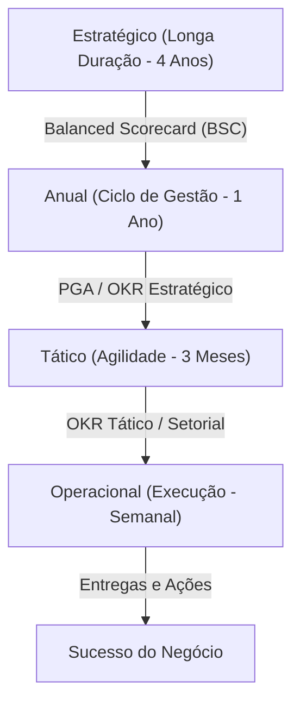

# 🏛️ Compêndio Farol OKR: O Guia Definitivo de Conceitos e Governança
**Versão 3.0 - Versão Master (Sebrae, Gupy, ClickUp, UFRJ Poli, ANVISA)**

> [!IMPORTANT]
> Este documento é a "Fonte Única da Verdade" (Single Source of Truth) para o sistema Farol OKR. Ele serve como o núcleo cognitivo para a Inteligência Artificial do projeto, para os desenvolvedores e para os gestores da organização. Qualquer funcionalidade ou decisão de gestão deve ser validada contra este guia.

---

## 🧭 1. Fundamentação Teórica e Evolução

A metodologia Farol OKR não nasceu do vazio; ela é a evolução de décadas de ciência da gestão:

*   **MBO (Management by Objectives - 1954):** Criado por **Peter Drucker**. Introduziu o alinhamento de metas, mas era rígido e Top-Down.
*   **iMBO (Intel OKRs - 1971):** **Andy Grove** (Intel) evoluiu o MBO para algo adaptativo, respondendo a: *"Onde quero chegar? (O)"* e *"Como saberei que cheguei? (KR)"*.
*   **OKR Moderno (Google/John Doerr - 1999):** Disseminou a cultura de transparência, foco em resultados e o uso de "Stretch Goals" (Metas Desafiadoras).
*   **Rigor Acadêmico (UFRJ Poli - 2023):** Introduz a análise de falácias de Mintzberg e a separação entre *Estratégia Pretendida* (Plano) e *Estratégia Realizada* (Ação).
*   **Governança de Estado (ANVISA - 2023):** Introduz a integração com o BSC, a gestão da Sustentação (BAU) e o papel do "OKR Champion".

---

## 🏗️ 2. Arquitetura do Sistema (Visão Sistêmica)

O Farol OKR opera em uma **Execução em Duas Velocidades (2SE)**, integrando três níveis de profundidade:

### 2.1. Nomenclatura e Ontologia
*   **Objetivo (O):** Qualitativo, Curto, Inspirador e Ambicioso. Define a direção.
*   **Key Results (KRs):** Quantitativos, Mensuráveis, Baseados em Valor (**Outcome**). O KR responde "o que mudou?", não "o que foi feito?".
*   **Entregas (Deliverables):** Ações de projeto necessárias para mover o KR (**Output**).
*   **Sustentação (BAU - Business as Usual):** Atividades de rotina. Não são OKRs, mas devem ser monitoradas para que a rotina não impeça a inovação.

---

## ❤️ 3. O Pátio Humano: CFR e Cultura "Corpo e Alma"

Gestão de performance sem humanização é burocracia. O sistema Farol integra:
*   **CFR (Conversations, Feedback, Recognition):** A estratégia é comunicada através de conversas contínuas, não de comandos únicos.
*   **OKR de Corpo e Alma:** Monitoramento trimestral de **e-NPS** (Satisfação), **Clima do Time** e percepção de felicidade.
*   **Linguagem Simples ("Sextou da Estratégia"):** A comunicação deve ser leve, democrática e periódica para vencer a resistência cultural.

---

## 🔄 4. Ritos e Cadências (O Ritmo do Coração)

A cadência é o que mantém a metodologia Viva.

| Rito | Frequência | Objetivo |
| :--- | :--- | :--- |
| **Kick-off** | Trimestral | Planejamento e alinhamento tático 50/50. |
| **Check-in** | Semanal | Monitorar saúde, atualizar confiança e remover bloqueios (15min). |
| **Review (Check-out)** | Trimestral | Avaliar atingimento e gerar aprendizado histórico. |
| **Retrospectiva** | Trimestral | Olhar para "Como" o time trabalhou, não para o número. |

---

## 📊 5. A Lógica da Verdade (FCA e Pontuação)

### 5.1. O Algoritmo FCA (Fato, Causa e Ação)
Obrigatório sempre que o **Score de Confiança** (1-10) for menor que 8.
*   **Fato:** O desvio objetivo (ex: "Atingimos 10% vs 30% esperado").
*   **Causa:** Investigação usando os **5 Porquês** para encontrar a raiz.
*   **Ação:** Plano Corretivo rigorosamente **SMART**.

### 5.2. As 3 Esferas de Análise (Métricas de Sucesso)
1.  **Adesão:** Disciplina nos ritos e preenchimento (Gamificação em Selos).
2.  **Performance:** Percentual de conclusão dos OKRs.
3.  **Resultado:** Impacto real nos indicadores financeiros e de mercado.

---

## 🏆 6. Gamificação e Maturidade (Sistema de Medalhas)

O Farol OKR certifica as unidades por maturidade técnica e disciplinar:
*   🥉 **Bronze:** Unidades que fazem check-ins semanais e mantêm confiança atualizada.
*   🥈 **Prata:** Unidades com KRs bem redigidos, alinhados verticalmente e com evidências claras.
*   🥇 **Ouro:** Unidades que batem resultados desafiadores mantendo alto e-NPS do time.

---

## ⚠️ 7. O Guia de Sobrevivência (Erros a Evitar)

Baseado no Slide 36 da ANVISA e nas Falácias de Mintzberg:
*   **Não "Maquie" metas antigas:** OKR exige mudança de mentalidade, não só de nome.
*   **O Tático não é Anual:** Se o tático demora um ano, ele não é ágil, é estático.
*   **O KR não é Tarefa:** Se o KR é "Fazer X", ele está errado. Deve ser "Atingir Y através de X".
*   **Não isole a Alta Gestão:** Sem patrocínio do topo, a metodologia morre na base.
*   **Não ignore a Sustentação (BAU):** O time vai se sentir sobrecarregado se você não enxergar o trabalho de rotina.

---

## 🤖 8. Dicionário de Conceitos para a IA (Core Logic)

Para processamento de dados e assistência do Copilot:
*   **Confidence Score (CS):** Indicador preditivo (1-10). Diferente do progresso acumulado, ele olha para o futuro.
*   **Vertical Alignment:** Um KR de nível inferior deve obrigatoriamente contribuir para um Objetivo de nível superior.
*   **Bi-direcionalidade (50/50):** O sistema deve facilitar a proposição de KRs pelas equipes para a diretoria.
*   **Evidence-Based:** Todo check-in deve ter um campo para "Artefato/Link de Comprovação".

---

## 💡 9. Banco de Exemplos Master

*   **Varejo (Caso UFRJ):** Aumentar ticket médio em 15%; Reduzir ruptura de estoque para < 2%.
*   **Engenharia:** Reduzir bugs críticos em 50%; Tempo médio de deploy < 10min.
*   **CS/Suporte:** Reduzir tempo de primeira resposta (SLA) para 1h; NPS acima de 75.

---
*Documento Normativo Definitivo - Versão 3.0*
*Compilado por Antigravity (AI) para o Fareol OKR Project*
*Referências: Sebrae, Gupy, ClickUp, UFRJ Poli, ANVISA*
